<p align="center">
  
</p>

<h1 align="center">PocketPaw</h1>

<p align="center">
  <strong>Your AI agent that lives on YOUR laptop, not some corporate datacenter.</strong>
</p>

<p align="center">
  <a href="https://pypi.org/project/pocketpaw/"></a>
  <a href="https://opensource.org/licenses/MIT"></a>
  <a href="https://www.python.org/downloads/"></a>
  <a href="https://pypi.org/project/pocketpaw/"></a>
</p>

<p align="center">
  Self-hosted, multi-agent AI platform. Talk through <strong>Telegram</strong>, work happens on your machine.<br>
  No subscription. No cloud lock-in. Just you and your Paw.
</p>

---

## Quick Start

```bash
pip install pocketpaw && pocketpaw
```

**That's it.** One command. 30 seconds. Your own AI agent.

<details>
<summary>More install options</summary>

```bash
# Isolated install
pipx install pocketpaw && pocketpaw

# Run without installing
uvx pocketpaw

# From source
git clone https://github.com/pocketpaw/pocketpaw.git
cd pocketpaw
uv run pocketpaw
```

</details>

PocketPaw will open your browser, walk you through Telegram bot setup, and be ready to go.
No Docker. No config files. No YAML. No dependency hell.

---

## What Can PocketPaw Do?

### Daily Life

```
You:  "Every Sunday evening, remind me which recycling bins to put out"
Paw:  *creates a recurring schedule*
Paw:  "Done. I'll check the recycling calendar and message you every Sunday at 6pm."

You:  "Organize my Downloads folder — PDFs by date, images by type, delete duplicates"
Paw:  *scans filesystem, moves 47 files, removes 12 duplicates*
Paw:  "All clean. Here's what I did: [summary]"
```

### Research & Browsing

```
You:  *drops a link in Telegram*
Paw:  *opens browser, reads the page, researches related topics*
Paw:  "Here's a summary with 3 key takeaways. Want me to save this to memory?"

You:  "Find the best flights from SFO to Tokyo in March"
Paw:  *opens browser, navigates flight sites, compares prices*
Paw:  "Found 4 options. Cheapest is $487 on ANA, departing Mar 12."
```

### Coding & DevOps

```
You:  "Set up a new FastAPI project with auth, tests, and Docker"
Paw:  *scaffolds project, writes boilerplate, creates Dockerfile*
Paw:  "Project ready at ~/projects/my-api. Run `docker compose up` to start."

You:  "Find that memory leak — the app crashes after 2 hours"
Paw:  *reads logs, profiles code, identifies the issue*
Paw:  "Found it. The WebSocket handler never closes connections. Here's the fix."
```

### Multi-Agent Workflows (Mission Control)

```
You:  "I need a competitor analysis report for our product launch"
Paw:  *spins up Agent A: web researcher, Agent B: data analyst, Agent C: writer*
Paw:  "3 agents working on it. Agent A is scraping competitor sites,
       Agent B is analyzing pricing data, Agent C is waiting to write the report.
       I'll ping you when it's ready."
```

---

## Architecture

```mermaid
graph TD
    %% Node Definitions
    User(["👤 YOU <br/>(Telegram / Web)"])
    
    subgraph Channels ["Channel Adapters"]
        Adapters["Telegram Bot  •  WebSocket Dashboard"]
    end

    subgraph Messaging ["Internal Transport"]
        Bus["<b>Message Bus</b><br/>Async Event Queue • Inbound/Outbound Routing"]
    end

    subgraph Core ["Core Intelligence"]
        direction TB
        subgraph AgentLoop ["Agent Loop"]
            Context["<b>Context Builder</b><br/>Identity + Soul + Style + Memory"]
            Router["<b>Agent Router</b>"]
            SDKs["Claude SDK (Recommended)<br/>Open Interpreter<br/>Native"]
            Context --> Router --> SDKs
        end

        subgraph MissionControl ["Mission Control"]
            Orch["Multi-agent Orchestration<br/>Task Assignment & Lifecycle<br/>Heartbeat Daemon (15 min)"]
            Stream["Live Execution Streaming<br/>Document Management<br/>Agent Status Tracking"]
            Status["Status: INBOX ➔ ASSIGNED ➔<br/>IN_PROGRESS ➔ REVIEW ➔ DONE"]
        end
    end

    subgraph Tools ["Tool Registry"]
        Registry["Shell • Filesystem • Browser • Desktop • Memory • HTTP Fetch"]
    end

    subgraph Support ["Security & Routing"]
        LLM["<b>LLM Router</b><br/>Anthropic • OpenAI • Ollama<br/>Auto-detection + Fallback"]
        Security["<b>Security Layer (Guardian AI)</b><br/>Command Blocking • Audit Logs<br/>File Jail (Sandbox) • Panic Button"]
    end

    subgraph Memory ["Memory System"]
        FileStore["<b>File Store</b> (Default)<br/>Markdown-based<br/>Human-readable"]
        Mem0["<b>Mem0 Store</b> (Optional)<br/>Semantic Vector Search<br/>Fact Extraction"]
        API["API: remember() • recall() • search() • get_context()"]
    end

    %% Connections
    User --> Adapters
    Adapters --> Bus
    Bus --> AgentLoop
    Bus --> MissionControl
    AgentLoop --> Registry
    Registry --> LLM
    Registry --> Security
    LLM --> Memory
    Security -.-> Registry

    %% Styling
    classDef default font-family:arial,font-size:14px;
    classDef highlight fill:#f9f,stroke:#333,stroke-width:2px;
    classDef coreBox fill:#f5f7ff,stroke:#4a90e2,stroke-width:2px;
    classDef securityBox fill:#fff5f5,stroke:#e53e3e,stroke-width:1px;
    
    class AgentLoop,MissionControl coreBox;
    class Security securityBox;
```



---

## Features

### Core Platform

| Feature | Description |
|---------|-------------|
| **Multi-Agent Orchestration** | Mission Control coordinates multiple agents on complex tasks with heartbeats, live streaming, and document management |
| **3 Agent Backends** | Claude Agent SDK (recommended), Open Interpreter, or PocketPaw Native — switch anytime |
| **Multi-LLM Support** | Anthropic, OpenAI, or Ollama (100% local). Auto-detection with fallback chain |
| **Telegram-First** | Control from anywhere. QR code pairing, no port forwarding needed |
| **Web Dashboard** | Real-time WebSocket UI with chat, mission control, file browser, and system monitoring |

### Intelligence

| Feature | Description |
|---------|-------------|
| **Persistent Memory** | Dual backend — file-based markdown + Mem0 semantic vector search. Remembers across sessions |
| **Persona System** | Identity, Soul, and Style files shape personality. Injected into every conversation |
| **Skills System** | YAML-based repeatable workflows. Hot-reload, argument substitution, agent-executed |
| **Browser Automation** | Playwright-powered. Navigates, clicks, types, screenshots. Accessibility tree for semantic page understanding |
| **Scheduling** | APScheduler-based reminders and recurring tasks with natural language time parsing |

### Security

| Feature | Description |
|---------|-------------|
| **Guardian AI** | Secondary LLM analyzes every shell command before execution. Blocks dangerous patterns |
| **Audit Logging** | Append-only log of every tool use, permission check, and security event |
| **File Jail** | Agents stay within allowed directories |
| **Panic Button** | Instant kill switch from Telegram or web dashboard |
| **Single User Lock** | Only your Telegram user ID can control the agent |

---

## Memory System

### Default: File-based Memory
Stores memories as readable markdown in `~/.pocketclaw/memory/`:
- `MEMORY.md` — Long-term facts about you
- `sessions/` — Conversation history

### Optional: Mem0 (Semantic Memory)
For smarter memory with vector search and automatic fact extraction:

```bash
pip install pocketpaw[memory]
```

Then set `MEMORY_BACKEND=mem0` in your environment. Mem0 gives you semantic search, automatic fact extraction, and memory evolution.

---

## Telegram Controls

| Button | Action |
|--------|--------|
| **Status** | CPU, RAM, disk, battery at a glance |
| **Fetch** | Browse and download files from your machine |
| **Screenshot** | Capture what's on screen |
| **Agent Mode** | Toggle autonomous execution |
| **Panic** | Emergency stop — halts all agents immediately |
| **Settings** | Switch LLM provider, agent backend, memory settings |

---

## Configuration

Config lives in `~/.pocketclaw/config.json`:

```json
{
  "telegram_bot_token": "your-bot-token",
  "allowed_user_id": 123456789,
  "agent_backend": "claude_agent_sdk",
  "llm_provider": "anthropic",
  "anthropic_api_key": "sk-ant-...",
  "memory_backend": "file"
}
```

Or use environment variables with the `POCKETCLAW_` prefix:

```bash
export POCKETCLAW_ANTHROPIC_API_KEY="sk-ant-..."
export POCKETCLAW_AGENT_BACKEND="claude_agent_sdk"
export POCKETCLAW_LLM_PROVIDER="ollama"
```

---

## Project Structure

```
src/pocketclaw/
├── agents/              # Agent backends & routing
│   ├── claude_sdk.py    #   Claude Agent SDK (recommended)
│   ├── open_interpreter.py  #   Open Interpreter backend
│   ├── pocketpaw_native.py  #   Native orchestrator
│   ├── router.py        #   Backend selection & delegation
│   └── loop.py          #   Main execution loop
├── mission_control/     # Multi-agent orchestration
│   ├── models.py        #   Agent, Task, Document, Activity models
│   ├── api.py           #   REST API endpoints
│   ├── manager.py       #   High-level facade
│   ├── executor.py      #   Task execution engine
│   └── heartbeat.py     #   Agent heartbeat daemon
├── bus/                 # Message routing
│   ├── queue.py         #   Async message bus
│   └── adapters/        #   Telegram & WebSocket adapters
├── memory/              # Persistent memory
│   ├── manager.py       #   Memory facade
│   ├── file_store.py    #   Markdown-based storage
│   └── mem0_store.py    #   Semantic vector search
├── tools/               # Tool system
│   ├── registry.py      #   Tool registry & execution
│   └── builtin/         #   Shell, filesystem, browser, desktop, memory
├── browser/             # Web automation
│   ├── driver.py        #   Playwright wrapper
│   └── snapshot.py      #   Accessibility tree snapshots
├── security/            # Safety layer
│   ├── guardian.py      #   AI command safety filter
│   └── audit.py         #   Action audit logging
├── skills/              # Extensible skills
├── bootstrap/           # Persona & context assembly
├── daemon/              # Proactive automation
├── llm/                 # LLM provider routing
├── config.py            # Settings (Pydantic)
├── dashboard.py         # Web dashboard (FastAPI)
├── bot_gateway.py       # Telegram bot gateway
├── scheduler.py         # Task scheduling
└── __main__.py          # Entry point
```

---

## Development

```bash
# Clone
git clone https://github.com/pocketpaw/pocketpaw.git
cd pocketpaw

# Install with dev dependencies
uv sync --dev

# Run tests
uv run pytest

# Lint
uv run ruff check .

# Run in web dashboard mode
uv run pocketpaw --web --port 8888
```

---

## Roadmap

See [Feature Audit vs OpenClaw](docs/FEATURE_AUDIT_VS_OPENCLAW.md) for a detailed gap analysis.

**Next up:**
- [ ] Web search tool (Brave/Tavily)
- [ ] Self-generating skills via conversation
- [ ] Smart model routing (Opus for coding, Haiku for chat)
- [ ] Telegram group topics for parallel conversations
- [ ] OAuth framework + Gmail, Calendar, Slack integrations
- [ ] Plan mode — agent proposes before executing
- [ ] Image generation & voice/TTS

---

## Join the Pack

- Twitter: [@PocketPawAI](https://twitter.com/PocketPaw89242)
- Discord: Coming Soon
- Email: pocketpawai@gmail.com

PRs welcome. Let's build the future of personal AI together.

---

## License

MIT &copy; PocketPaw Team

<p align="center">
  
  <br>
  <strong>Made with love for humans who want AI on their own terms</strong>
</p>
